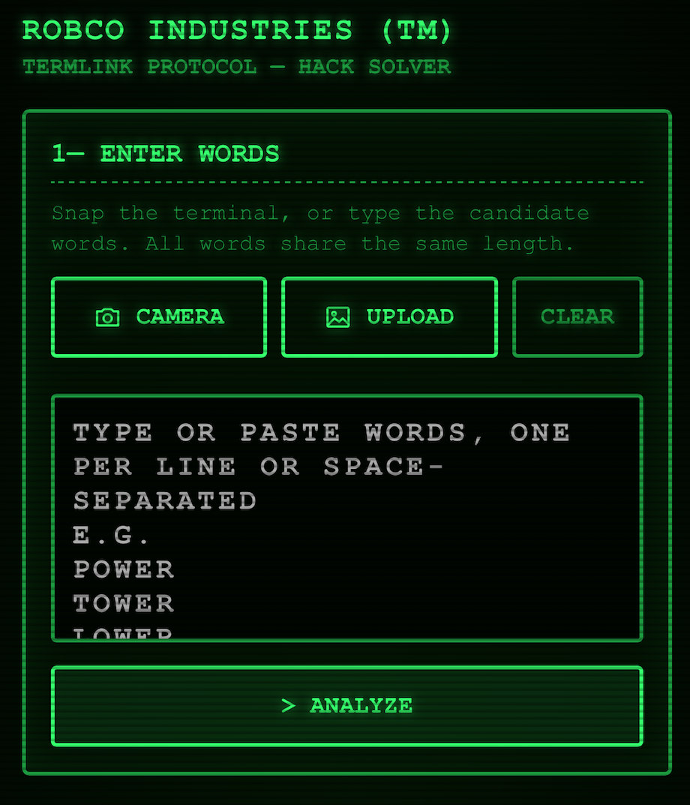
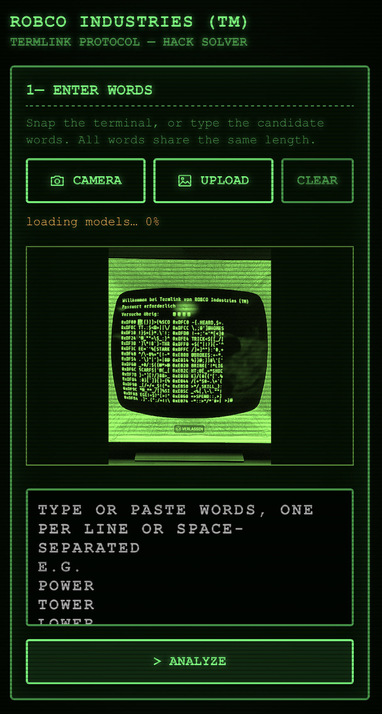
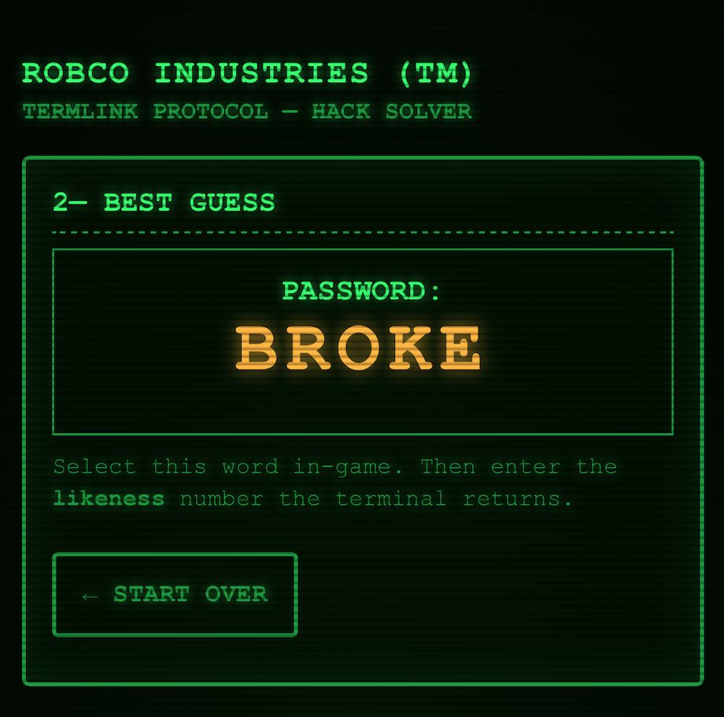

# ROBCO Terminal Hack Solver

[](https://github.com/andiikaa/fallout-terminal-hack/actions/workflows/deploy.yml)

A mobile-first PWA that solves Fallout's terminal hacking minigame — snap a
photo of the terminal, and it reads the candidate words and tells you the
optimal word to guess.

**[Live app](https://andiikaa.github.io/fallout-terminal-hack/)**

| Enter words | Read from a photo | Best guess |
| :---: | :---: | :---: |
|  |  |  |

## How it works

1. **Capture** — take a photo, pick one, or type the words.
2. **OCR** — read fully in-browser by **PaddleOCR (PP-OCRv6)** on
   onnxruntime-web (WebGPU, WASM fallback), with Tesseract.js as a backup.
3. **Reconstruct** — rebuild the terminal's memory order from box geometry so
   wrapped words rejoin (`TECHN` + `ICAL` = TECHNICAL).
4. **Solve** — a **minimax** solver picks the guess minimizing the worst-case
   number of remaining candidates.
5. **Feedback** — enter the *likeness* the terminal returns; the solver narrows
   the list and recommends the next word until the password is found.

Everything runs on-device — your photo never leaves the browser. The OCR models
are fetched once and cached by the service worker, so the app works offline
after first load.

## Run it

```bash
pnpm install
pnpm dev       # http://localhost:5173
pnpm build     # production build in dist/
pnpm test      # unit / reconstruction regression tests
pnpm test:e2e  # full OCR pipeline in a headless browser (Playwright)
```

Deployed to GitHub Pages automatically on push to `master`
(see `.github/workflows/deploy.yml`).
